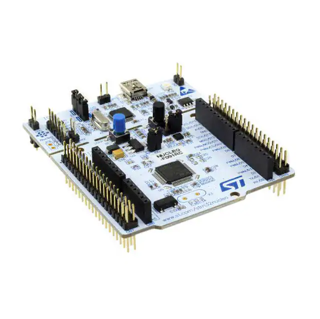
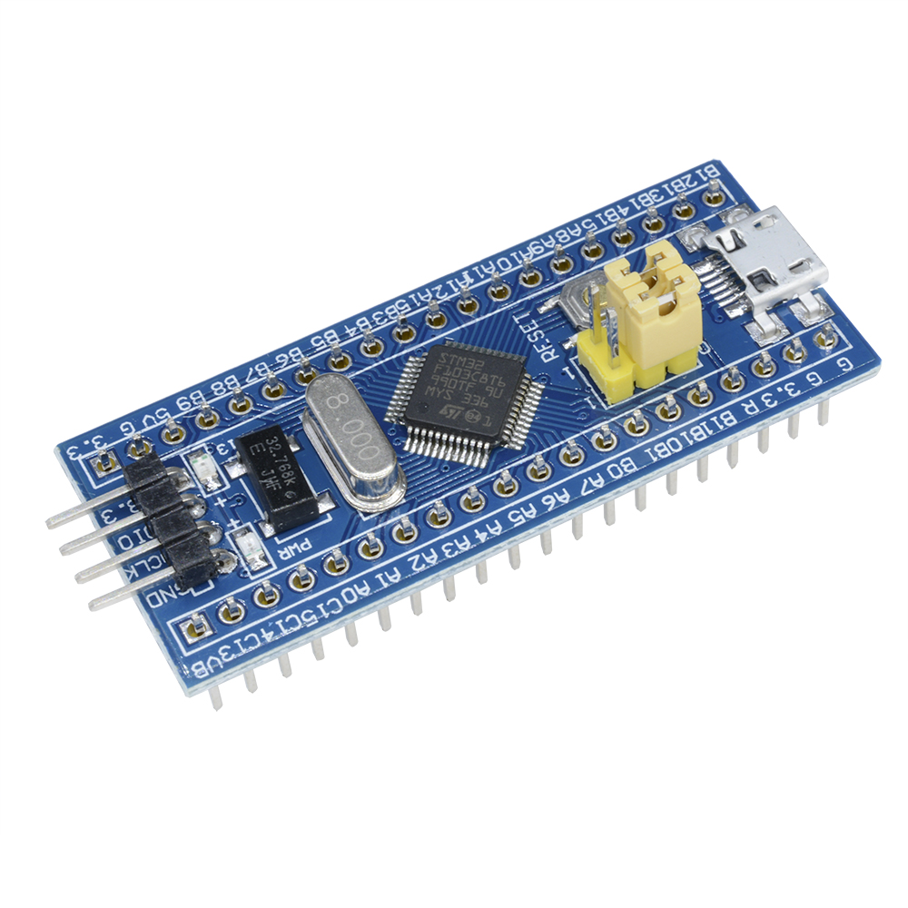
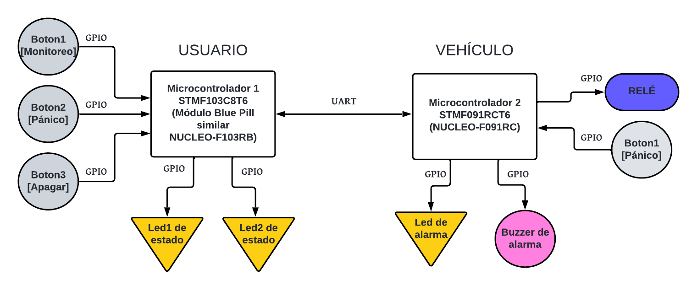

# TP1-ArmBookCurso2024: Sistema de Prevención de Robo de Vehículos

## Alumno
Betsabé Ailén Rodríguez
betsabe.a.rodriguez@gmail.com

## Objetivo
Desarrollar un sistema adicional de seguridad que permita detener un automóvil ante una situación de robo o hurto.

## Descripción

El sistema consiste en la comunicación entre dos módulos: uno que portará el conductor o usuario del vehículo y otro que estará instalado en el automóvil. Este sistema está diseñado para responder rápidamente a situaciones de robo o hurto deteniendo el vehículo mediante la interrupción de la energía que alimenta al motor. Los módulos se iniciarán en modo `OFF` por defecto, dado que la mayoría de los vehículos ya cuentan con sistemas de alarma incorporados. Sin embargo, este sistema ofrece una capa adicional de seguridad, especialmente útil en casos donde la llave del vehículo es sustraída por la fuerza o cuando el tiempo de reacción para activar una alarma es muy corto. La comunicación entre los módulos, inicialmente pensada para ser inalámbrica, será simulada mediante UART.

### Estado de `MONITOR`
- **Activación:** Se activa presionando el botón 1 en el módulo del usuario.
- **Operación:** El módulo del usuario envía datos y espera una respuesta del módulo del vehículo. Ambos módulos registran el tiempo de espera entre los datos recibidos. Si la conexión se pierde, el módulo del vehículo entra en el estado de `PANIC`. Si el módulo del usuario no recibe la respuesta dentro del tiempo predefinido, los LEDs del usuario parpadearán para indicar la falta de comunicación.

### Estado de `PANIC`
- **Activación:** Se activa presionando el botón 2 en el módulo del usuario, o mediante un botón oculto dentro del vehículo.
- **Operación:** El módulo del usuario enviará un mensaje de emergencia. Al recibir este mensaje o mediante el botón oculto, el módulo del vehículo iniciará una cuenta de tiempo. Durante este tiempo, el vehículo seguirá operativo, alertando al conductor con una alarma sonora y visual. Pasados 20 segundos, el motor del vehículo se desenergiza, deteniéndose el automóvil. El módulo del usuario continuará enviando mensajes hasta recibir una respuesta. Si no se recibe una respuesta válida dentro de los 5 segundos, los LEDs del usuario parpadearán. 

### Estado `OFF`
- **Activación:** Se activa presionando el botón 3 en el módulo del usuario.
- **Operación:** Al presionar este botón, se cancelan los estados de `PANIC` y `MONITOR`, cesando la comunicación entre los módulos y permitiendo al conductor operar el vehículo con normalidad. La alarma sonora y visual se apagan y el relé queda en estado de reposo.

Este sistema proporciona una capa adicional de seguridad para situaciones de robo, ofreciendo una respuesta rápida y efectiva para detener el vehículo y proteger al usuario.

## Plataformas de Desarrollo
- NUCLEO-F091RC

- Módulo de desarrollo para STM32F103C8T6 “Blue Pill” (similar al NUCLEO-F103RB)

## Periféricos a Utilizar del Módulo de Usuario
- **BOTÓN 1:** Activa el estado de monitoreo de seguridad.
- **BOTÓN 2:** Activa el estado de pánico.
- **BOTÓN 3:** Desactiva los estados anteriores y entra en estado apagado.
- **LED 1:** Indica que está activo el modo de monitoreo.
- **LED 2:** Indica que está activo el modo de pánico.
- **UART:** Comunicación entre módulos.

## Periféricos a Utilizar del Módulo del Vehículo
- **BOTÓN 1:** Activa el modo de pánico.
- **LED:** Parpadea para indicar que el vehículo está pronto a detenerse.
- **BUZZER:** Alarma sonora que indica que el vehículo está pronto a detenerse.
- **UART:** Comunicación entre módulos.
- **RELÉ:** Energiza o desenergiza el motor del vehículo.

Para más información de cada uno de los módulos, ingrese en los proyectos adjuntos de cada uno.
